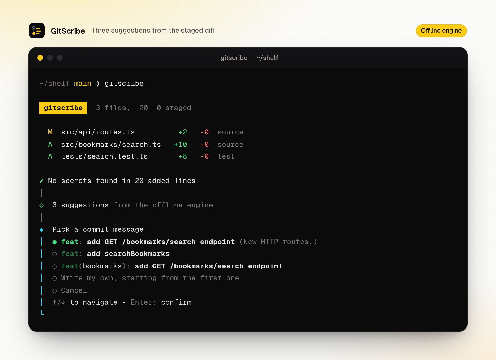
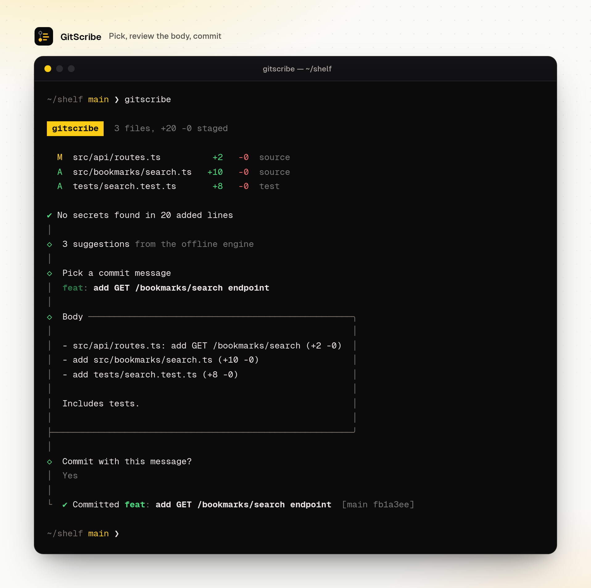
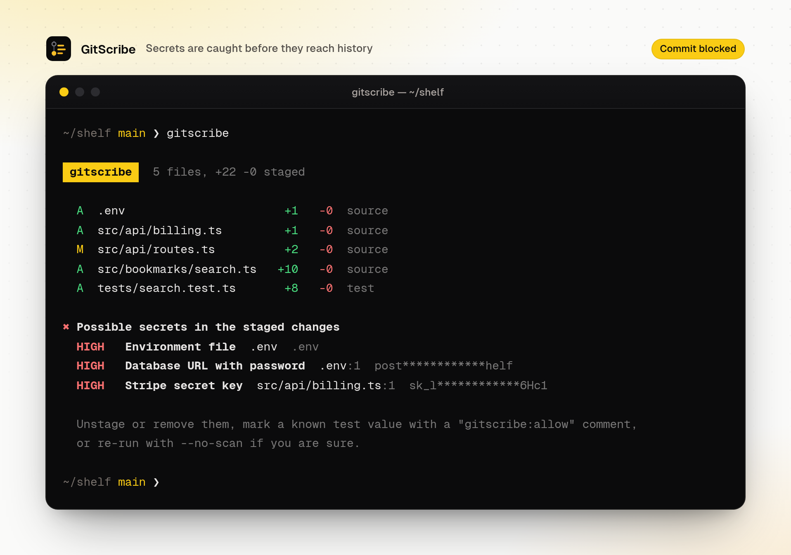
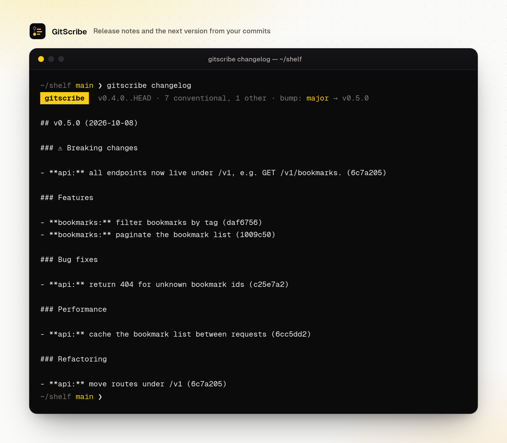
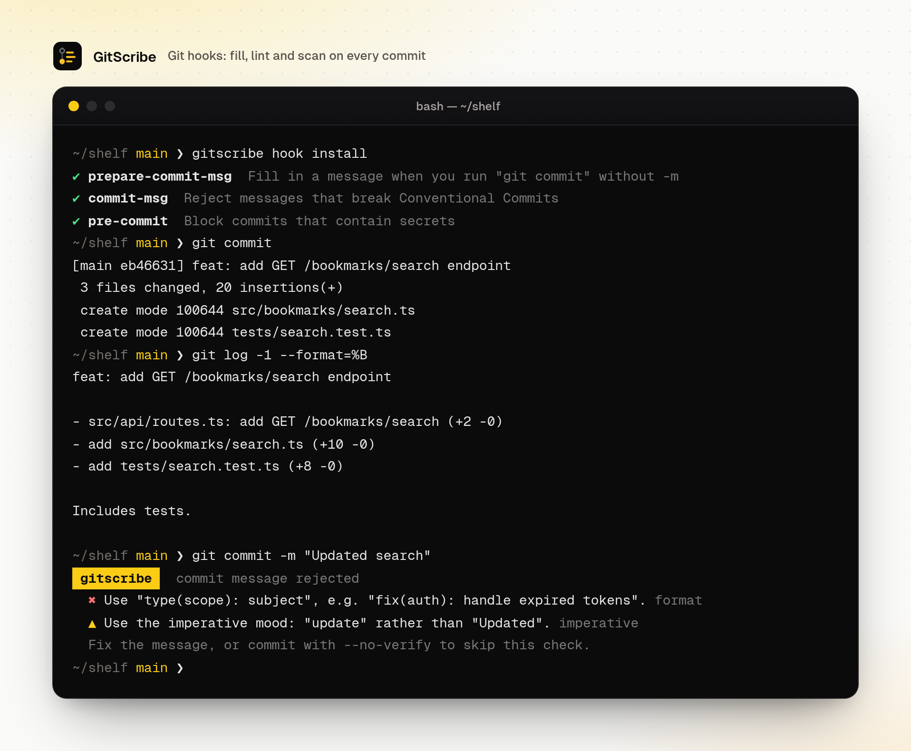
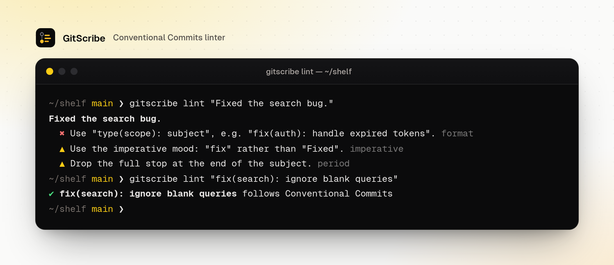
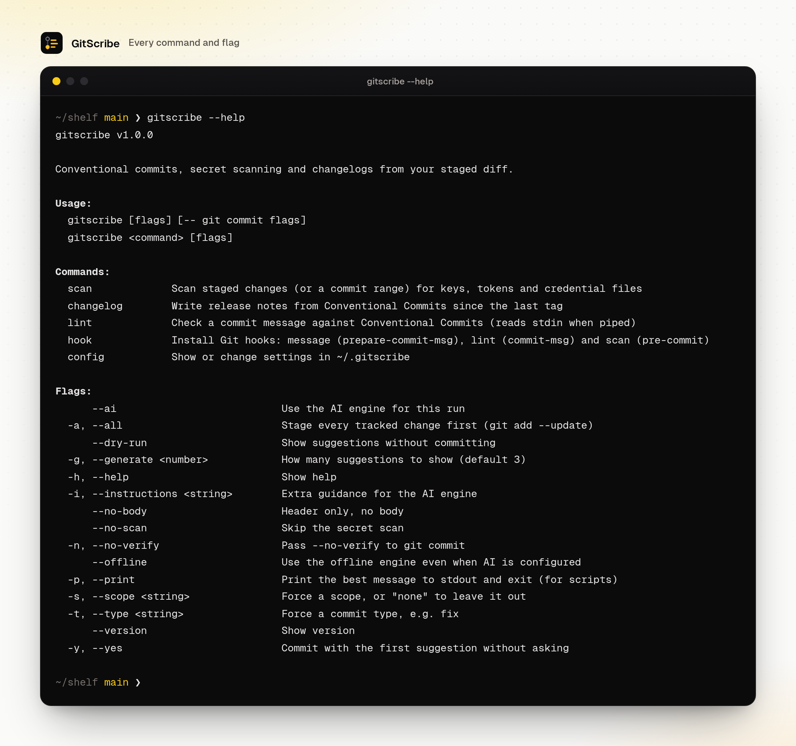

<div align="center">


# GitScribe

### Commit messages that say what changed.

GitScribe reads your staged diff and writes a Conventional Commit for it. It checks the same diff for leaked keys before anything reaches history. Later it turns those commits into release notes and tells you the next version.

Works fully offline. Can use any OpenAI-compatible model when you want one.



</div>

---

## Why

Most commit history reads like `update`, `fix stuff`, `wip`. That makes reviews slower, changelogs manual and `git blame` useless. GitScribe makes the good message the easy one. Stage your work, run `gitscribe`, pick a suggestion and commit. The same tool stops a `.env` file or a live API key from slipping into a commit, which is much harder to undo after a push.

## What it does

**Commit messages from the diff, without a model**
- The offline engine looks at *what kind* of files changed (source, tests, docs, CI, build, dependencies, config) and *what the changed lines do*. That covers new routes, new or removed functions, null checks, `try/catch`, `Promise.all`, deprecations, renames and whitespace-only edits.
- It picks the type (`feat`, `fix`, `perf`, `refactor`, `docs`, `test`, `ci`, `build`, `chore`, `style`) and a scope from the folders involved. It also names the actual thing: `feat: add GET /bookmarks/search endpoint`, `build(deps): bump next from 15.1.0 to 16.0.2`, `fix(example): prevent NullPointerException in processItems`.
- Removed exports are marked breaking (`feat(api)!:`) with a `BREAKING CHANGE:` footer.
- You get up to three alternatives, each with a one-line reason, and a file-by-file body.
- Headers are kept within your length limit (72 by default) and always pass the built-in linter.

**AI engine (optional)**
- Point it at OpenAI, OpenRouter, Groq, or a local Ollama or LM Studio server: any OpenAI-compatible `/v1` endpoint.
- Lockfiles are left out of the prompt and large diffs are trimmed file by file.
- Replies are validated, cleaned up and length-checked. If the model returns something unusable, GitScribe tells you instead of committing it.

**Secret scanner**
- Runs on every commit by default and blocks it when it finds:
  - private keys
  - AWS, GitHub, GitLab, OpenAI, Anthropic, Google, Stripe, Slack, Discord, npm, SendGrid and Twilio credentials
  - JWTs
  - database URLs with passwords
- Also catches high-entropy values assigned to names like `password` or `api_key`, plus committed `.env`, `.pem` or `id_rsa` files.
- Placeholders such as `changeme`, `your-api-key` or `process.env.X` are ignored. Known test values can be marked with a `gitscribe:allow` comment.
- Findings show the file and line with the value masked. `gitscribe scan --range main..HEAD` audits commits you already made, and `--json` feeds CI.

**Changelog and versioning**
- `gitscribe changelog` groups commits since the last tag into Breaking changes, Features, Bug fixes, Performance and Refactoring.
- It works out the semver bump (major, minor or patch; before 1.0 a breaking change bumps the minor version) and links each commit when the repo has a remote.
- `--write` prepends the section to `CHANGELOG.md`.

**Linter and Git hooks**
- `gitscribe lint` checks:
  - type and format
  - scope
  - imperative mood ("add", not "added")
  - casing and trailing full stops
  - vague subjects like `fix: update`
  - header length and body wrapping
- `gitscribe hook install` adds three hooks. None of them replaces a hook you already have.
  - `prepare-commit-msg` fills in the message on a plain `git commit`.
  - `commit-msg` rejects messages that break the rules.
  - `pre-commit` runs the secret scan.

## Screenshots

| Commit flow | Secret blocked |
|---|---|
|  |  |

| Changelog with version bump | Git hooks |
|---|---|
|  |  |

| Linter | All commands |
|---|---|
|  |  |

The screenshots are real output from the CLI, run against a small demo repository.

## Run locally

Requires Node.js 20 or newer and Git.

```bash
git clone https://github.com/gabrielolarinre74-pixel/gitscribe-ai.git
cd gitscribe-ai
npm install
npm run build
npm link        # puts `gitscribe` and `gsc` on your PATH
```

Then, in any repository:

```bash
git add -p
gitscribe              # pick a message and commit
gitscribe --print      # just print the best message (for scripts and editors)
gitscribe -a -y        # stage tracked changes and commit with the top suggestion
gitscribe scan         # check staged changes for secrets
gitscribe changelog    # release notes since the last tag
gitscribe hook install # fill, lint and scan on every commit
```

Anything after `--` goes to `git commit`, e.g. `gitscribe -- --signoff`.

### Using a model

```bash
gitscribe config set engine=ai model=gpt-4o-mini api-key=sk-...
# or a local model, no key needed
gitscribe config set engine=ai base-url=http://localhost:11434/v1 model=llama3.1
```

Settings live in `~/.gitscribe` (file mode 600). Each one can also come from the environment, for example `GITSCRIBE_API_KEY` or `GITSCRIBE_MODEL`; see [.env.example](.env.example). Use `--offline` to skip the model for one run. Plain `http` is only accepted for localhost.

| Setting | Default | |
|---|---|---|
| `engine` | `offline` | `offline` or `ai` |
| `base-url` | `https://api.openai.com/v1` | Any OpenAI-compatible endpoint |
| `model` | `gpt-4o-mini` | |
| `api-key` | | Stored locally, never printed in full |
| `max-length` | `72` | Header length limit |
| `body` | `true` | Add a file-by-file body |
| `block-secrets` | `true` | Block commits when the scanner finds something |
| `instructions` | | House style for the AI engine, e.g. "British English" |

## Development

```bash
npm test          # Vitest: engine, scanner, changelog, config, AI parsing, CLI end to end
npm run lint      # type-check
npm run build     # bundle to dist/cli.mjs
npm run dev -- --dry-run
```

```
src/
  cli.ts              commands and flags
  commands/           commit, scan, changelog, lint, hook, config
  core/
    diff.ts           unified diff parser with enclosing-function tracking
    classify.ts       file kinds and scope detection
    symbols.ts        declarations across JS/TS, Python, Go, Rust, Ruby, Java, Kotlin
    offline.ts        the offline commit message engine
    message.ts        Conventional Commits format, parser and linter
    secrets.ts        secret rules, entropy check, masking
    changelog.ts      grouping, semver bump, Markdown rendering
    ai.ts             prompt, OpenAI-compatible client, reply validation
    config.ts         ~/.gitscribe and GITSCRIBE_* overrides
tests/                unit tests, diff fixtures and CLI tests in throwaway repos
```

Built with TypeScript, cleye, @clack/prompts, kolorist, the Vercel AI SDK, zod, tsup and Vitest. CI runs type-check, tests, build and a CLI smoke test on Node 20 and 22.

## License

MIT. See [LICENSE](LICENSE).

---

Designed and built by **Gabriel Zion · Gabriel.ATH**. I build websites, apps and AI automation that help businesses grow. [Portfolio](https://gabrielzion-portfolio.vercel.app)
